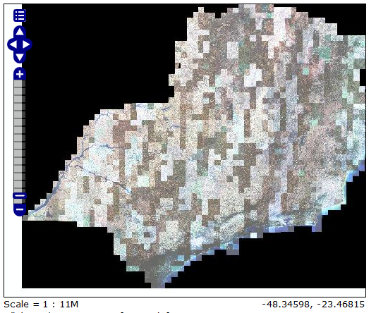
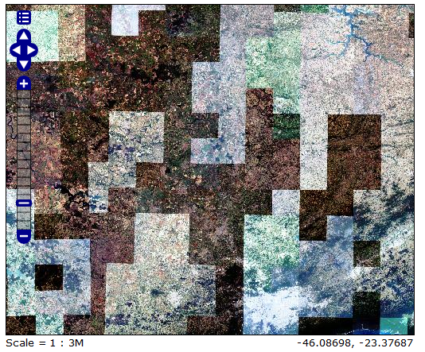
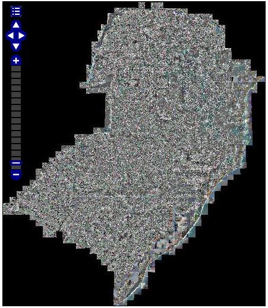
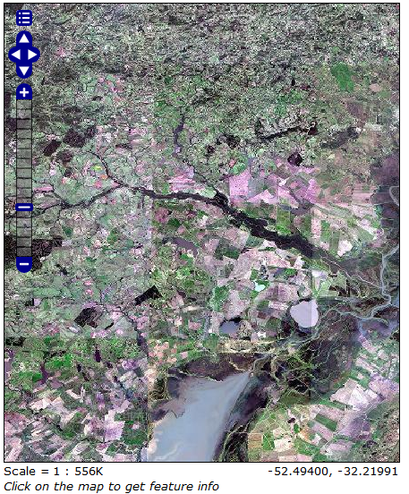

# RapidEye histogram balance

This code will take a RapidEye Image and apply a 2 standard deviation color balance. It will then rescale the image to 8bits and save a new TIF.

Purpose: Do a crude color balance on several images so we can create a 'color balanced' mosaic.

I explained this in the post:  
https://gis.stackexchange.com/questions/95435/color-balance-and-publish-large-amount-of-high-resolution-imagery-in-geoserver/100097?noredirect=1#comment496785_100097

Script will run on one image at a time. So my recommendation is to use it with `xargs`, in order to do a parallel processing.

**Example run:**

1. Generate a list of files to process  
  `grep -f lista_pr.txt todos_arquivos_tif_2014.txt > todos_arquivos_2014_pr.txt`

2. Run with `xargs`  
  `cat todos_arquivos_2014_pr.txt | xargs -n 1 -P 5 -I % /c/projetos/codigos/rapideye/rapideye_hist2sd.py -b 1 2 3 4 5 -m -md /z/rapideye2014_udm -sk 5 % .`  

  *for large file lists, it might be better to split it in smaller chunks. Take a look at `split` command*

3. Get a list of the output images and create a mosaic  
  `ls 8bit*.tif > lista_mt2014_normalizado`  
  ``gdalbuildvirt.exe -b 5 -b 3 -b 2 -input_file_list <lista dos arquivos> <rs2014_b532.vrt>``

4. Convert to *TMS* or whatever format you wish  
  `gdal2tiles.py -z '5-15' rs2014_2sd_udm/rs2014_b532.vrt rs2014_b532_tms`

**Some before / after images:**

*Before...*

  
*Brazil Southeast, no color balance*

  
*Brazil Southeast, no color balance - zoom*

*After...*

  
*Brazil Sul mosaic, crude color balance*

  
*Brazil Sul mosaic, crude color balance - zoom*
